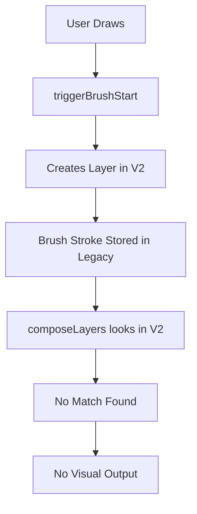

# 🎯 LAYER SYSTEM CONSOLIDATION PLAN

## 📋 **EXECUTIVE SUMMARY**

The ClOSSET 3D Clothing Design Platform currently has **5 conflicting layer systems** running simultaneously, causing critical issues:

- ✅ **Layer creation is working** but not visible
- ❌ **Text tool causes texture fade**
- ❌ **Layer ordering buttons work in opposite direction**
- ❌ **Brush strokes not visible on model**
- ❌ **Multiple systems creating conflicting data**

## 🔍 **ROOT CAUSE ANALYSIS**

### **Conflicting Systems Identified:**

1. **Legacy `useApp` layers** (`App.tsx`)
2. **`useAdvancedLayerStore`** (old advanced system)
3. **`useAdvancedLayerStoreV2`** (new advanced system) ⭐ **TARGET SYSTEM**
4. **`useLayerManager`** (from stores)
5. **`useLayerStore`** (from domain stores)

### **Critical Data Flow Issues:**

## 🎯 **CONSOLIDATION STRATEGY**

### **Phase 1: System Removal**
- Remove `useAdvancedLayerStore` (old system)
- Remove `useLayerManager` imports
- Remove `LayerSystemBridge` (broken bridge)
- Keep only `useAdvancedLayerStoreV2` as single source of truth

### **Phase 2: Data Migration**
- Move brush stroke storage to V2 system
- Move text element storage to V2 system
- Update all tools to store data in V2 system
- Fix layer composition to use V2 data only

### **Phase 3: UI Synchronization**
- Fix layer ordering logic in UI
- Ensure UI shows V2 layers only
- Fix layer property controls to work with V2 system
- Test all layer operations

### **Phase 4: Canvas Standardization**
- Standardize all canvas sizes to 1536x1536
- Fix UV coordinate mapping
- Ensure consistent texture updates

## 📁 **FILES TO MODIFY**

### **Files to Remove:**
- `apps/web/src/core/AdvancedLayerSystem.ts`
- `apps/web/src/stores/LayerManager.ts`
- `apps/web/src/core/LayerSystemBridge.ts`

### **Files to Update:**
- `apps/web/src/App.tsx` (remove legacy layer logic)
- `apps/web/src/components/ShirtRefactored.tsx` (use V2 only)
- `apps/web/src/components/RightPanelCompact.tsx` (use V2 only)

## 🧪 **TESTING STRATEGY**

### **Pre-Fix Tests:**
- [ ] Document current behavior
- [ ] Record all existing issues
- [ ] Test each tool individually

### **Post-Fix Tests:**
- [ ] Test brush tool creates visible layers
- [ ] Test text tool works without texture fade
- [ ] Test layer ordering buttons work correctly
- [ ] Test all layer properties (opacity, visibility, blend modes)
- [ ] Test performance with single system

## 📊 **SUCCESS METRICS**

- ✅ Single layer system running (V2 only)
- ✅ Automatic layer creation on drawing
- ✅ Real-time layer updates in UI
- ✅ Proper layer ordering (up/down buttons work correctly)
- ✅ Text tool functionality restored
- ✅ Brush strokes visible on model
- ✅ Layer properties working
- ✅ Performance improvement (no conflicting systems)

## 🚨 **RISK MITIGATION**

- **Backup**: Current codebase committed to GitHub
- **Incremental**: Fix one system at a time
- **Testing**: Test after each major change
- **Rollback**: Keep ability to revert changes

---

**Status**: Ready to begin systematic consolidation
**Next Action**: Start Phase 1 - System Removal
